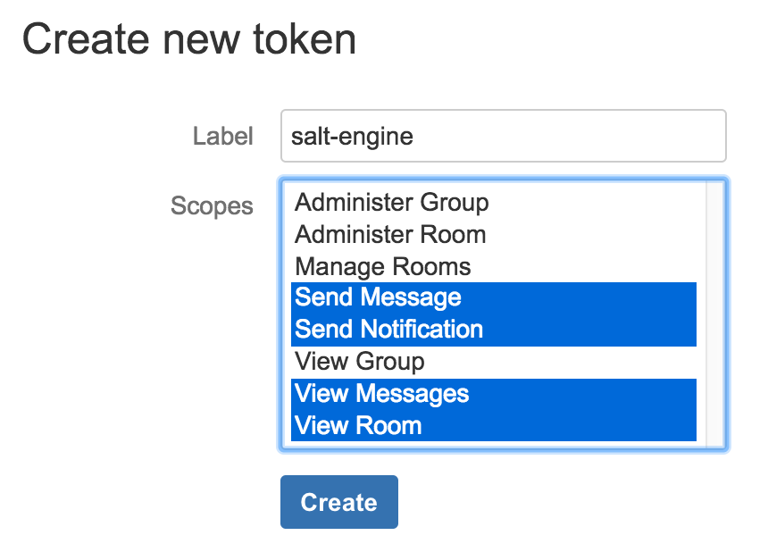
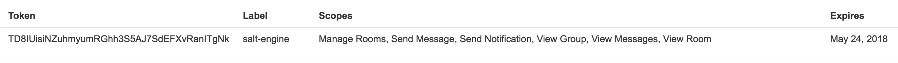
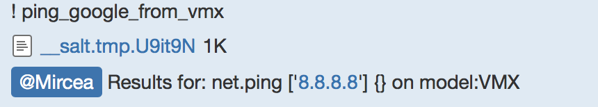

There are many common misconceptions around Salt, and very often people seem to miss that Salt is more than a configuration management product, while it is a rich orchestrator with configuration management capabilities. Yet another interesting assertion I heard recently was: "In Salt is very hard or impossible to setup chatops". Nothing more incorrect. I didn't know how easy it is till this morning, when I had a few minutes to play around. The answer is: just a couple of YAML lines.

In this post I am going to use the [hipchat engine](https://docs.saltstack.com/en/latest/ref/engines/all/salt.engines.hipchat.html), but exactly the same methodology can be applied when using [Slack](https://docs.saltstack.com/en/latest/ref/engines/all/salt.engines.slack.html) -- one should notice that even the configuration options are exactly the same!

HipChat setup
-------------

1. Create a dedicated user, although you can even use your personal account
2. From the admin panel: ```Edit Profile``` -> ```API Access``` scroll to the ```Create new token``` section. Assign a label and select the scopes:



This will generate a new HipChat token, which is a 40 characters long string.

Under the API Access page, a new line should appear, looking like:



In this example, ```TD8IUisiNZuhmyumRGhh3S5AJ7SdEFXvRanITgNk``` is the generated token and what I will use in the configuration below.

Setup Salt
----------

In the very first place, make sure that the machine running the Salt master is able to execute HTTP requests to the HipChat server ([https://api.hipchat.com/](https://api.hipchat.com/) if you are using the public API).

In the [documentation](https://docs.saltstack.com/en/latest/ref/engines/all/salt.engines.hipchat.html) it says that the HipChat engine depends on ```hypchat```, so we need to install that Python package: ```pip install hypchat```. This library does not have any particular system dependency.

This tutorial assumes that you have the NAPALM and Salt environment setup. To ensure this, here are a couple of resources:

- [my recent RIPE 74 tutorial](https://ripe74.ripe.net/presentations/18-RIPE-74-Network-automation-at-scale-up-and-running-in-60-minutes.pdf)
- [the official Salt network automation documentation](https://docs.saltstack.com/en/develop/topics/network_automation/index.html)
- Some of my previous posts: [installation](https://mirceaulinic.net/2017-03-14-install-saltstack/) or [introduction](https://mirceaulinic.net/2016-11-17-network-orchestration-with-salt-and-napalm/)

In my sandbox I had two devices: ```device1``` running Junos and ```device2``` running IOS.

I am going to add the following lines in the master config file (tipically ```/etc/salt/master```):

```yaml
engines:
  - hipchat:
      token: TD8IUisiNZuhmyumRGhh3S5AJ7SdEFXvRanITgNk
      room: 'Network Automation'
      control: True
```

**5 lines -- that's all required for the basic usage**. The ```salt-master``` process must to be restart everytime after its configuration file is changed.

Typing ```! net.arp target=device1``` in the _Network Automation_ hipchat room, we can see a new event pushed on the [Salt event bus](https://docs.saltstack.com/en/2015.8/topics/event/index.html):

```python
salt/engines/hipchat/incoming {
    "_stamp": "2017-05-24T10:19:30.657648",
    "date": "2017-05-24T10:19:30.682426+00:00",
    "from": {
        "id": 298,
        "links": {
            "self": "https://api.hipchat.com/v2/user/298"
        },
        "mention_name": "Mircea",
        "name": "Mircea Ulinic",
        "version": "SAT2E7EA"
    },
    "id": "bc6e6dee-8c72-440d-8551-032f3bb2d6d3",
    "mentions": [],
    "message": "! net.arp target='device1'",
    "type": "message"
}
```

Which creates a new job to be executed on ```device1```:

```python
20170524101930719629  {
    "_stamp": "2017-05-24T10:19:30.720284",
    "minions": [
        "device1"
    ]
}
salt/job/20170524101930719629/new {
    "_stamp": "2017-05-24T10:19:30.720552",
    "arg": [],
    "fun": "net.arp",
    "jid": "20170524101930719629",
    "minions": [
        "device1"
    ],
    "tgt": "device1",
    "tgt_type": "glob",
    "user": "root"
}
```

And at the end, the device provides its ARP table, following [NAPALM's format](https://docs.saltstack.com/en/develop/ref/modules/all/salt.modules.napalm_network.html#salt.modules.napalm_network.arp):

```python
salt/job/20170524101930719629/ret/device1 {
    "_stamp": "2017-05-24T10:19:30.948945",
    "cmd": "_return",
    "fun": "net.arp",
    "fun_args": [],
    "id": "device1",
    "jid": "20170524101930719629",
    "retcode": 0,
    "return": {
        "comment": "",
        "out": [
            {
                "age": null,
                "interface": "em1.0",
                "ip": "128.0.0.16",
                "mac": "02:00:00:00:00:10"
            },
            {
                "age": 1211.0,
                "interface": "fxp0.0",
                "ip": "172.31.0.1",
                "mac": "02:8B:CA:89:F9:35"
            },
            {
                "age": 433.0,
                "interface": "fxp0.0",
                "ip": "172.31.0.2",
                "mac": "02:8B:CA:89:F9:35"
            },
            {
                "age": 647.0,
                "interface": "fxp0.0",
                "ip": "172.31.5.175",
                "mac": "02:E0:CF:EB:1B:F1"
            }
        ],
        "result": true
    },
    "success": true
}
```

To retrieve the ARP table only from a certain interface, one is able to execute: ```! net.arp interface=em1.0 target=device1```.

Targeting one or more devices follows the specifications from [Targeting Minions](https://docs.saltstack.com/en/latest/topics/targeting/), where the keywords are ```target``` and ```tgt_type```. For example, if we want to execute a ping to ```8.8.8.8``` from all Juniper MX960 routers, we can do so by typing: ```! net.ping 8.8.8.8 target=model:MX960 tgt_type=grain```.

To filter users, allow only certain commands and define aliases, we can define a structure as in the example below:

```yaml
engines:
  - hipchat:
      token: TD8IUisiNZuhmyumRGhh3S5AJ7SdEFXvRanITgNk
      room: 'Network Automation'
      control: True
      valid_users:
        - Mircea
      valid_commands:
        - test.ping
        - net.arp
        - list_jobs
      aliases:
        list_jobs:
          cmd: jobs.list_jobs
        get_arp_tables:
          cmd: net.arp target=device*
        ping_google_from_vmx:
          cmd: net.ping 8.8.8.8 target=model:VMX tgt_type=grain
```

And we can simply type: ```! ping_google_from_vmx``` and it returns in HipChat:



Which uploads a file with the result of the execution:

```python
{
    "device1": {
        "comment": "",
        "out": {
            "success": {
                "packet_loss": 0,
                "probes_sent": 5,
                "results": [
                    {
                        "ip_address": "8.8.8.8",
                        "rtt": 20.279
                    },
                    {
                        "ip_address": "8.8.8.8",
                        "rtt": 19.981
                    },
                    {
                        "ip_address": "8.8.8.8",
                        "rtt": 19.903
                    },
                    {
                        "ip_address": "8.8.8.8",
                        "rtt": 20.031
                    },
                    {
                        "ip_address": "8.8.8.8",
                        "rtt": 20.205
                    }
                ],
                "rtt_avg": 20.079,
                "rtt_max": 20.279,
                "rtt_min": 19.903,
                "rtt_stddev": 0.14
            }
        },
        "result": true
    }
}
```

Note that also the special character ```!``` can be replaced with something else in case the user prefers, using the ```trigger``` option in the engine configuration.

As well as running operational commands, one can also execute states directly from HipChat or Slack and apply configuration changes. Another advantage of Salt is that it permits a dry-run mode that returns the configuration diff; afterwards, if the diff looks right, the user can deploy the changes. For example, using the [netntp](https://docs.saltstack.com/en/latest/ref/states/all/salt.states.netntp.html) state that manages NTP peers & servers configuration, one execute a dry run: ```! state.sls router.ntp test=True target=device1```. If the output looks good, they will commit by running the same command, withouth the ```test``` flag: ```! state.sls router.ntp target=device1```.

Conclusions
-----------

We've seen that enabling chatops in Salt for network automation needs is almost trivial, requiring only 5 lines of YAML to be appended to the master configuration file. Afterwards, the user can apply the same methodologies as running Salt commands from the CLI.
